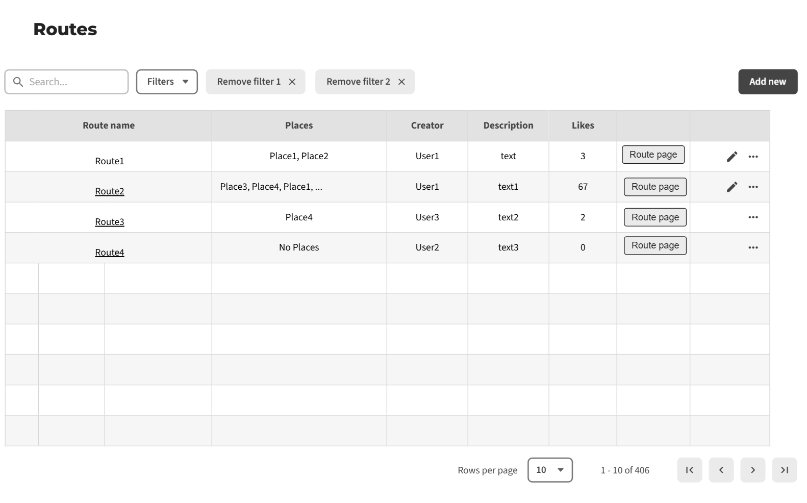

# Software Requirements Specification (SRS)
# Travel Share Application

**Версия:** 1.0

---
## Содержание
1. [Введение](#1-введение)
    - 1.1 [Назначение](#11-назначение)
    - 1.2 [Бизнес-требования](#12-бизнес-требования)
        - 1.2.1 [Исходные данные](#121-исходные-данные)
        - 1.2.2 [Возможности бизнеса](#122-возможности-бизнеса)
        - 1.2.3 [Границы проекта](#123-границы-проекта)
    - 1.3 [Аналоги](#13-аналоги)
2. [Требования пользователя](#2-требования-пользователя)
    - 2.1 [Программные интерфейсы](#21-программные-интерфейсы)
    - 2.2 [Интерфейс пользователя](#22-интерфейс-пользователя)
    - 2.3 [Характеристики пользователей](#23-характеристики-пользователей)
        - 2.3.1 [Классы пользователей](#231-классы-пользователей)
        - 2.3.2 [Аудитория приложения](#232-аудитория-приложения)
    - 2.4 [Предположения и зависимости](#24-предположения-и-зависимости)
3. [Системные требования](#3-системные-требования)
    - 3.1 [Функциональные требования](#31-функциональные-требования)
        - 3.1.1 [Основные функции](#311-основные-функции)
        - 3.1.2 [Ограничения и исключения](#312-ограничения-и-исключения)
    - 3.2 [Нефункциональные требования](#32-нефункциональные-требования)
        - 3.2.1 [Атрибуты качества](#321-атрибуты-качества)
        - 3.2.2 [Внешние интерфейсы](#322-внешние-интерфейсы)
        - 3.2.3 [Ограничения](#323-ограничения)

---

## 1 Введение

### 1.1 Назначение
Этот документ описывает функциональные и нефункциональные требования к веб-приложению **Travel Share**. Документ предназначен для команды разработчиков, тестировщиков и всех участников проекта, участвующих в реализации и верификации корректности работы приложения.

### 1.2 Бизнес-требования

### 1.2.1 Исходные данные
Многие люди любят путешествовать, открывать новые места и делиться своими впечатлениями. Однако организация поездки и планирование маршрута часто сопряжены с трудностями: поиск информации в разных источниках, необходимость запоминать или записывать понравившиеся локации, отсутствие единого места для хранения travel-впечатлений. Существующие аналоги часто перегружены функционалом или являются узкоспециализированными сервисами (бронирование, карты), но не предоставляют простого инструмента для личного планирования и учета.

### 1.2.2 Возможности бизнеса
Простое и удобное веб-приложение, позволяющее пользователям создавать личную базу интересных мест, составлять из них маршруты и делиться своими открытиями, удовлетворит потребность аудитории в структурировании travel-опыта. Это позволит пользователям сосредоточиться на самом путешествии, а не на организации, тратя меньше времени на планирование. Удобный интерфейс, ориентированный на быстрый ввод и просмотр информации, позволит привлечь широкий круг пользователей, а возможность делиться маршрутами создаст дополнительную ценность и вовлеченность.

### 1.2.3 Границы проекта
Приложение **Travel Share** позволит зарегистрированным пользователям сохранять места (достопримечательности, кафе, отели и т.д.), создавать из них маршруты для будущих или прошедших поездок, а также просматривать маршруты, созданные другими пользователями. Для неаутентифицированных пользователей (гостей) будет доступен просмотр публичных маршрутов. Приложение не предоставляет функционала для бронирования билетов или отелей, интеграции с платежными системами и служит исключительно для планирования и учета.

### 1.3 Аналоги
*   **Google Maps / My Maps:** Позволяет сохранять места на карте и создавать собственные карты. **Отличие:** Наш сервис более заточен под структурирование именно путешествий (маршрутов), предлагает более простой и сфокусированный интерфейс для этой цели.
*   **TripAdvisor:** Крупная платформа с отзывами, бронированием. **Отличие:** Наш сервис является более личным и легковесным, предназначенным не для поиска и оценки, а для сохранения и систематизации уже найденного.
*   **Polarsteps:** Сервис для автоматического трекинга путешествий. **Отличие:** Наше приложение ориентировано на ручное планирование *будущих* поездок и организацию информации о местах.

## 2 Требования пользователя

### 2.1 Программные интерфейсы
*   Backend приложения реализован на **Spring Boot** (Java).
*   Для хранения данных используется реляционная **SQL база данных** (например, PostgreSQL/MySQL/H2).
*   Фронтенд может быть реализован на Thymeleaf или отдельно на современном JS-фреймворке (React/Vue), взаимодействующем с REST API бэкенда.

### 2.2 Интерфейс пользователя
Мокапы (прототипы) интерфейса будут разработаны с помощью инструмента **app.moqups.com** (или аналога) и выложены в репозиторий в папку `/mockups`. Эскизы включают:
*   Страницу регистрации и авторизации.
  
    
    
*   Главную страницу с обзором личных и публичных маршрутов.

    

*   Страницу создания/редактирования маршрута.

    

### 2.3 Характеристики пользователей

### 2.3.1 Классы пользователей
| Класс пользователей | Описание |
| :--- | :--- |
| **Гости** | Неаутентифицированные пользователи. Могут просматривать публичные маршруты, созданные другими пользователями. Не могут создавать и редактировать контент. |
| **Зарегистрированные пользователи** | Аутентифицированные пользователи. Имеют полный доступ к функционалу: создание, просмотр, редактирование и удаление своих мест и маршрутов. Могут делать свои маршруты публичными или приватными. |

### 2.3.2 Аудитория приложения

#### 2.3.2.1 Целевая аудитория
Путешественники-энтузиасты, блогеры, туристы, которые активно планируют свои поездки и хотят систематизировать информацию о понравившихся местах.

#### 2.3.2.2 Побочная аудитория
Люди, занимающиеся организацией поездок для других (например, организаторы групповых туров).

### 2.4 Предположения и зависимости
*   Пользователи имеют базовые навыки работы с веб-приложениями.
*   Для полноценной работы приложения пользователю необходим стабильный доступ в Интернет.
*   Функционал приложения ограничен возможностями выбранного стека технологий (Spring Boot).

## 3 Системные требования

### 3.1 Функциональные требования

### 3.1.1 Основные функции

#### 3.1.1.1 Регистрация и аутентификация пользователя
**Описание.** Пользователь должен иметь возможность создать учетную запись или войти в существующую для получения доступа к полному функционалу.

| Функция | Требования |
| :--- | :--- |
| **Регистрация нового пользователя** | Система должна запросить уникальный логин (email) и пароль. После успешной регистрации пользователь автоматически аутентифицируется. |
| **Аутентификация пользователя** | Система должна предоставить форму для ввода логина и пароля. При успешном вводе система предоставляет доступ к аккаунту. |
| **Выход из системы** | Аутентифицированный пользователь должен иметь возможность выйти из системы. |

#### 3.1.1.2 Управление профилем пользователя
**Описание.** Аутентифицированный пользователь должен иметь возможность просматривать и редактировать данные своего профиля.

**Требование.** Система должна предоставить интерфейс для изменения данных пользователя (например, имя, аватар).

#### 3.1.1.3 Управление местами (Places)
**Описание.** Аутентифицированный пользователь должен иметь возможность добавлять, просматривать, редактировать и удалять места из своей личной коллекции.

| Функция | Требования |
| :--- | :--- |
| **Добавление нового места** | Система должна предоставить форму для ввода данных о месте: название, описание, адрес, тип (достопримечательность, ресторан и т.д.), геометки (координаты). |
| **Просмотр списка мест** | Система должна отображать список всех мест, добавленных пользователем, с возможностью фильтрации и поиска. |
| **Редактирование и удаление места** | Пользователь должен иметь возможность редактировать или удалить любое из своих мест. |

#### 3.1.1.4 Управление маршрутами (Routes)
**Описание.** Аутентифицированный пользователь должен иметь возможность создавать маршруты из существующих мест, а также просматривать, редактировать и удалять их.

| Функция | Требования |
| :--- | :--- |
| **Создание нового маршрута** | Система должна предоставить интерфейс для создания маршрута: название, описание, выбор мест из личной коллекции пользователя, установка порядка мест в маршруте. |
| **Просмотр маршрутов** | Система должна отображать список маршрутов пользователя. При выборе маршрута отображается детальная информация о нем и списке мест. |
| **Просмотр публичных маршрутов** | Все пользователи (включая гостей) должны иметь возможность просматривать маршруты, которые были размещены как публичные. |
| **Редактирование и удаление маршрута** | Пользователь должен иметь возможность редактировать (изменять название, описание, состав мест) или удалить любой из своих маршрутов. |

#### 3.1.1.5 Поиск и просмотр публичного контента
**Описание.** Пользователи должны иметь возможность искать и просматривать публичные маршруты, созданные другими пользователями.

**Требование.** Система должна предоставить интерфейс поиска и фильтрации по публичным маршрутам (например, по названию, тегам).

### 3.1.2 Ограничения и исключения
*   Приложение не отвечает за точность и актуальность информации, введенной пользователями о местах.
*   Функционал построения оптимального пути между точками маршрута (логистика) в первоначальной версии не реализуется. Маршрут представляет собой упорядоченный список точек.

### 3.2 Нефункциональные требования

### 3.2.1 Атрибуты качества

#### 3.2.1.1 Требования к удобству использования
*   Интерфейс должен быть интуитивно понятным и простым для нового пользователя.
*   Навигация по приложению должна быть последовательной и логичной.
*   Время обучения работе с основными функциями не должно превышать 15 минут.

#### 3.2.1.2 Требования к безопасности
*   Пароли пользователей должны храниться в базе данных в захэшированном виде.
*   Пользователь имеет доступ только к своим данным (местам и маршрутам), если они не помечены как публичные.
*   Все операции на стороне сервера должны проверять авторизацию пользователя.

#### 3.2.1.3 Требования к доступности
*   Основные функции приложения должны быть доступны при скорости интернета не ниже 1 Мбит/с.
*   Время отклика на большинство пользовательских действий не должно превышать 2 секунд.

### 3.2.2 Внешние интерфейсы
*   **Пользовательский интерфейс:** Должен быть выполнен в минималистичном, современном стиле. Шрифты должны быть читаемыми, размер элементов — достаточным для комфортного использования на десктопных и мобильных устройствах (адаптивный дизайн).
*   **Программный интерфейс:** Приложение предоставляет REST API для взаимодействия между клиентом и сервером.

### 3.2.3 Ограничения
*   Приложение реализовано как веб-приложение на основе **Spring Boot**.
*   Язык разработки backend: **Java**.
*   Для хранения данных используется реляционная **SQL БД**.
