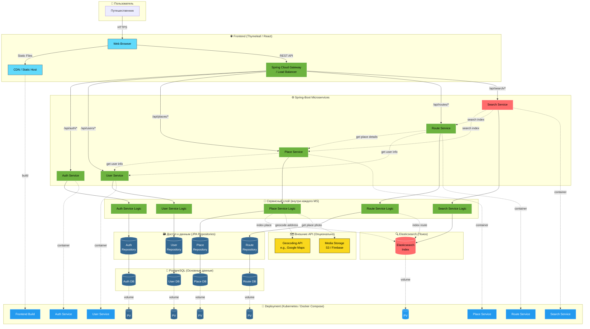

```mermaid
graph TB
    subgraph "👤 Пользователь"
        U[Путешественник]
    end

    %% ---------- Frontend ----------
    subgraph "🌐 Frontend (Thymeleaf / React)"
        U --> |HTTPS| WEB[Web Browser]
        WEB --> |Static Files| CDN[CDN / Static Host]
        WEB --> |REST API| GW[API Gateway]
    end

    %% ---------- Gateway / LB ----------
    GW[Spring Cloud Gateway<br/>/ Load Balancer]

    %% ---------- Backend Services ----------
    subgraph "⚙️ Spring-Boot Microservices"
        GW --> |/api/auth/*| AUTH[Auth Service]
        GW --> |/api/users/*| US[User Service]
        GW --> |/api/places/*| PS[Place Service]
        GW --> |/api/routes/*| RS[Route Service]
        GW --> |/api/search/*| SS[Search Service]
        
        %% Internal service communication
        PS -.-> |get user info| US
        RS -.-> |get place details| PS
        RS -.-> |get user info| US
        SS -.-> |search index| PS
        SS -.-> |search index| RS
    end

    %% ---------- Services ----------
    subgraph "🔧 Сервисный слой (внутри каждого MS)"
        AUTH --> AUTH_S[Auth Service Logic]
        US --> US_S[User Service Logic]
        PS --> PS_S[Place Service Logic]
        RS --> RS_S[Route Service Logic]
        SS --> SS_S[Search Service Logic]
    end

    %% ---------- Repositories ----------
    subgraph "🗃️ Доступ к данным (JPA Repositories)"
        AUTH_S --> AUTH_R[(Auth<br/>Repository)]
        US_S --> USER_R[(User<br/>Repository)]
        PS_S --> PLACE_R[(Place<br/>Repository)]
        RS_S --> ROUTE_R[(Route<br/>Repository)]
    end

    %% ---------- Базы данных ----------
    subgraph "🐘 PostgreSQL (Основные данные)"
        AUTH_R --> DB_AUTH[(Auth DB)]
        USER_R --> DB_USER[(User DB)]
        PLACE_R --> DB_PLACE[(Place DB)]
        ROUTE_R --> DB_ROUTE[(Route DB)]
    end

    subgraph "🔍 Elasticsearch (Поиск)"
        SS_S --> ES[(Elasticsearch<br/>Index)]
        PS_S -.-> |index place| ES
        RS_S -.-> |index route| ES
    end

    %% ---------- Внешние компоненты ----------
    subgraph "🗺️ Внешние API (Опционально)"
        PS_S -.-> |geocode address| GEO[Geocoding API<br/>e.g., Google Maps]
        PS_S -.-> |get place photo| MEDIA[Media Storage<br/>S3 / Firebase]
    end

    %% ---------- Deployment ----------
    subgraph "🐳 Deployment (Kubernetes / Docker Compose)"
        CDN -.-> |build| STAT[Frontend Build]
        AUTH -.-> |container| DOCK_AUTH[Auth Service]
        US -.-> |container| DOCK_US[User Service]
        PS -.-> |container| DOCK_PS[Place Service]
        RS -.-> |container| DOCK_RS[Route Service]
        SS -.-> |container| DOCK_SS[Search Service]
        DB_AUTH -.-> |volume| VOL_AUTH[(PV)]
        DB_USER -.-> |volume| VOL_USER[(PV)]
        DB_PLACE -.-> |volume| VOL_PLACE[(PV)]
        DB_ROUTE -.-> |volume| VOL_ROUTE[(PV)]
        ES -.-> |volume| VOL_ES[(PV)]
    end

    %% ---------- Стили ----------
    classDef frontend fill:#61dafb,stroke:#282c34,color:#000
    classDef backend fill:#6db33f,stroke:#fff,color:#000
    classDef db fill:#336791,stroke:#fff,color:#fff
    classDef external fill:#f9d71c,stroke:#000,color:#000
    classDef deployment fill:#239aef,stroke:#fff,color:#fff
    classDef search fill:#ff6b6b,stroke:#fff,color:#000

    class WEB,CDN frontend
    class GW,AUTH,US,PS,RS,SS,AUTH_S,US_S,PS_S,RS_S,SS_S backend
    class DB_AUTH,DB_USER,DB_PLACE,DB_ROUTE,AUTH_R,USER_R,PLACE_R,ROUTE_R,VOL_AUTH,VOL_USER,VOL_PLACE,VOL_ROUTE db
    class GEO,MEDIA external
    class STAT,DOCK_AUTH,DOCK_US,DOCK_PS,DOCK_RS,DOCK_SS,VOL_ES deployment
    class ES,SS search
```
