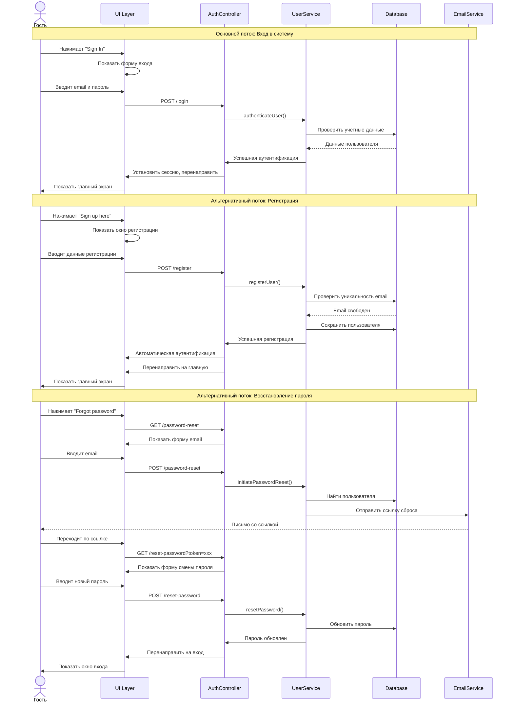
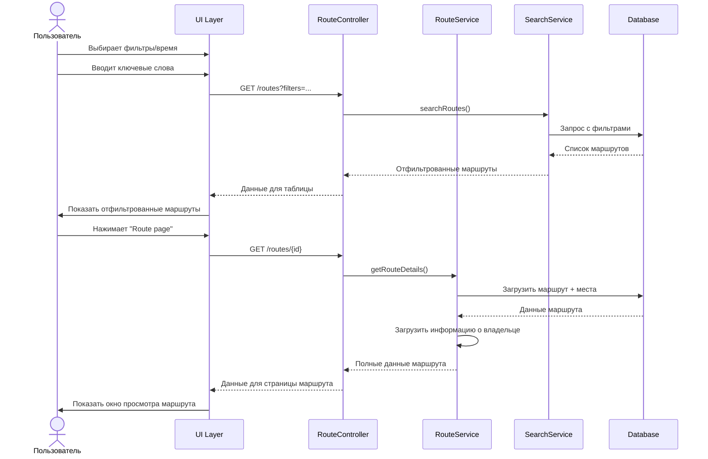
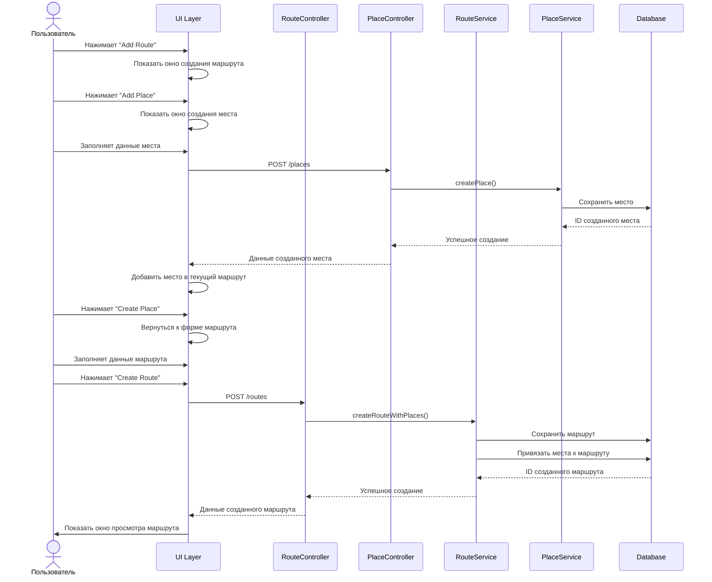

# Диаграммы последовательностей и активностей

## Диаграмма последовательности 1: Регистрация и восстановление пароля

**Описание:** Процесс регистрации нового пользователя и восстановления пароля

## Диаграмма последовательности 2: Поиск и просмотр публичных маршрутов

**Описание:** Процесс поиска маршрутов по фильтрам и просмотра деталей маршрута

## Диаграмма последовательности 3: Создание маршрута с местами

**Описание:** Процесс создания нового маршрута с добавлением мест

