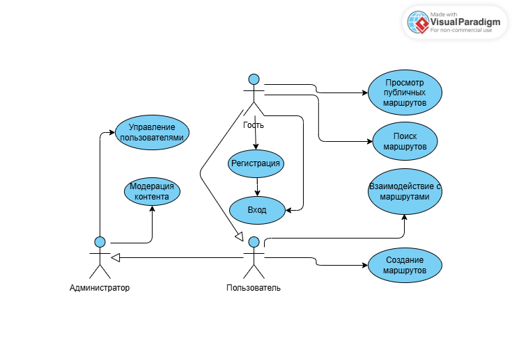

# Use Case Представление (Обновленное)

## Диаграмма вариантов использования

## Глоссарий

| Термин | Определение |
|--------|-------------|
| **Гость** | Неаутентифицированный пользователь веб-приложения. Может просматривать публичный контент. Для создания и управления личным контентом требуется регистрация и аутентификация. |
| **Пользователь** | Аутентифицированный зарегистрированный пользователь приложения. Может создавать, просматривать, редактировать и удалять свои места и маршруты, а также просматривать публичные маршруты других пользователей. |
| **Администратор** | Привилегированный пользователь, отвечающий за управление системой, модерацию контента и техническую поддержку. Имеет доступ ко всем функциям системы. |
| **Место (Place)** | Локация, представляющая интерес для путешественника (например, достопримечательность, ресторан, отель). Содержит название, описание, адрес, координаты и тип. |
| **Маршрут (Route)** | Упорядоченный список мест, объединённый общей темой или поездкой. Имеет название, описание и статус видимости (публичный/приватный). |
| **Публичный маршрут** | Маршрут, созданный пользователем и доступный для просмотра всем посетителям приложения, включая гостей. |
| **Приватный маршрут** | Маршрут, созданный пользователем и доступный только ему. |

## Содержание

1. [Актеры](#1-актеры)
2. [Варианты использования](#2-варианты-использования)
   - [2.1 Зарегистрироваться](#21-зарегистрироваться)
   - [2.2 Войти в систему](#22-войти-в-систему)
   - [2.3 Просмотреть публичные маршруты](#23-просмотреть-публичные-маршруты)
   - [2.4 Поиск маршрутов](#24-поиск-маршрутов)
   - [2.5 Создать маршрут](#25-создать-маршрут)

## 1. Актеры

| Актер | Описание |
|-------|-----------|
| **Гость** | Неаутентифицированный пользователь веб-приложения. Может просматривать публичный контент. Для создания и управления личным контентом требуется регистрация и аутентификация. |
| **Пользователь** | Аутентифицированный зарегистрированный пользователь приложения. Может создавать, просматривать, редактировать и удалять свои места и маршруты, а также просматривать публичные маршруты других пользователей. |

## 2. Варианты использования

### 2.1 Зарегистрироваться

**Описание**  
Вариант использования "Зарегистрироваться" позволяет Гостю создать новую учётную запись в системе.

**Предусловия**  
Гость находится на главной странице или на странице аутентификации.

**Основной поток**
1. Гость нажимает кнопку "Зарегистрироваться"
2. Система отображает форму регистрации, запрашивая адрес электронной почты (email), имя пользователя и пароль
3. Гость вводит email, имя пользователя и пароль, подтверждает пароль и отправляет форму
4. Система проверяет валидность email (уникальность в системе), уникальность имени пользователя и соответствие пароля политике безопасности
5. Система создаёт новую учётную запись Пользователя, хэширует пароль и автоматически аутентифицирует его
6. Система перенаправляет Пользователя на его личную главную страницу
7. Вариант использования завершается

**Альтернативный поток А1: Данные невалидны**
- Если введённые данные не проходят проверку (email не уникален, имя пользователя занято, пароль слишком простой, пароли не совпадают), система отображает соответствующее сообщение об ошибке
- Возврат к пункту 3 основного потока

**Альтернативный поток А2: Отмена регистрации**
- Гость нажимает кнопку "Отмена" или возвращается на предыдущую страницу до подтверждения отправки формы
- Система возвращает Гостя на страницу, с которой был начат процесс регистрации
- Вариант использования завершается досрочно

**Постусловия**  
В системе создана новая учётная запись. Гость получает статус "Пользователь" и аутентифицирован в системе.

### 2.2 Войти в систему

**Описание**  
Вариант использования "Войти в систему" позволяет зарегистрированному Пользователю аутентифицироваться в системе.

**Предусловия**  
Пользователь не аутентифицирован (Гость) и находится на главной странице или на странице аутентификации.

**Основной поток**
1. Гость нажимает кнопку "Войти"
2. Система отображает форму входа, запрашивая email/имя пользователя и пароль
3. Пользователь вводит свои учетные данные и отправляет форму
4. Система проверяет наличие пользователя с такими данными и соответствие введённого пароля хэшу в базе данных
5. При успешной проверке система создаёт сессию и перенаправляет Пользователя на его личную главную страницу
6. Вариант использования завершается

**Альтернативный поток А1: Неверные учётные данные**
- Если email/имя пользователя или пароль неверны, система отображает общее сообщение об ошибке аутентификации ("Неверный логин или пароль")
- Возврат к пункту 3 основного потока

**Постусловия**  
Пользователь аутентифицирован в системе и имеет доступ к своему личному контенту.

### 2.3 Просмотреть публичные маршруты

**Описание**  
Вариант использования позволяет любому посетителю приложения (Гостю или Пользователю) просматривать маршруты, которые были опубликованы как публичные.

**Предусловия**  
Актер находится в приложении.

**Основной поток**
1. Актер переходит в раздел "Исследовать" или "Публичные маршруты"
2. Система отображает ленту или список публичных маршрутов, созданных всеми пользователями. Для каждого маршрута отображается название, автор, краткое описание и обложка (если есть)
3. Актер выбирает (кликает) на понравившийся маршрут для просмотра деталей
4. Система открывает страницу маршрута, где отображается полное описание, карта с отмеченными местами и их упорядоченный список
5. Вариант использования завершается

**Альтернативный поток А1: Публичные маршруты отсутствуют**
- Если в системе нет ни одного публичного маршрута, система отображает сообщение "Публичные маршруты пока не добавлены"

**Постусловия**  
Актер ознакомился с содержимым публичного маршрута.

### 2.4 Поиск маршрутов

**Описание**  
Вариант использования позволяет Гостю или Пользователю находить маршруты по ключевым словам и фильтрам.

**Предусловия**  
Актер находится в разделе публичных маршрутов.

**Основной поток**
1. Актер вводит ключевые слова в поле поиска и/или выбирает фильтры (по типу мест, длительности, сложности)
2. Актер нажимает кнопку "Поиск" или система автоматически начинает поиск при вводе
3. Система проверяет каждый маршрут на соответствие заданным критериям
4. Система отображает только те маршруты, которые соответствуют условиям поиска
5. Актер может просматривать найденные маршруты
6. Вариант использования завершается

**Альтернативный поток А1: Маршруты не найдены**
- Если ни один маршрут не соответствует критериям поиска, система отображает сообщение "По вашему запросу ничего не найдено"
- Актер может изменить параметры поиска

**Альтернативный поток А2: Сброс поиска**
- Актер нажимает кнопку "Сбросить" для очистки фильтров
- Система возвращает отображение всех публичных маршрутов
- Вариант использования завершается

**Постусловия**  
Актер получил список маршрутов, соответствующих критериям поиска.

### 2.5 Создать маршрут

**Описание**  
Вариант использования позволяет Пользователю создать новый маршрут, включая возможность создания новых мест непосредственно в процессе создания маршрута.

**Предусловия**  
Пользователь аутентифицирован в системе.

**Основной поток**
1. Пользователь переходит в раздел "Мои маршруты" и нажимает кнопку "Создать маршрут"
2. Система отображает форму создания маршрута с полями: название, описание, статус видимости (публичный/приватный)
3. Пользователь заполняет основные данные маршрута
4. Пользователь нажимает кнопку "Добавить место" для включения мест в маршрут
5. **Подпоток: Добавление существующего места**
   - 5.1 Система отображает список существующих мест пользователя
   - 5.2 Пользователь выбирает места из списка и добавляет их в маршрут
   - 5.3 Пользователь устанавливает порядок мест в маршруте
6. **Альтернативный подпоток: Создание нового места**
   - 6.1 Если нужного места нет в списке, пользователь нажимает "Создать новое место"
   - 6.2 Система отображает форму создания места внутри модального окна
   - 6.3 Пользователь заполняет данные места: название, описание, адрес, координаты, тип
   - 6.4 Пользователь нажимает "Сохранить место"
   - 6.5 Система проверяет обязательность заполнения поля "Название"
   - 6.6 Система сохраняет новое место и автоматически добавляет его в текущий маршрут
7. Пользователь повторяет шаги 4-6 до добавления всех необходимых мест
8. Пользователь нажимает кнопку "Сохранить маршрут"
9. Система проверяет, что указано название и в маршрут добавлено хотя бы одно место
10. Система сохраняет новый маршрут в базу данных
11. Система отображает сообщение об успехе и перенаправляет Пользователя на страницу созданного маршрута
12. Вариант использования завершается

**Альтернативный поток А1: Данные маршрута невалидны**
- Если название не указано или в маршруте нет мест, система отображает соответствующее сообщение об ошибке
- Возврат к пункту 8 основного потока

**Альтернативный поток А2: Данные места невалидны**
- При создании нового места, если обязательные поля не заполнены, система отображает сообщение об ошибке
- Возврат к пункту 6.3 альтернативного подпотока

**Альтернативный поток А3: Отмена создания маршрута**
- Пользователь нажимает кнопку "Отмена" до сохранения маршрута
- Система запрашивает подтверждение отмены
- При подтверждении система возвращает Пользователя на страницу списка маршрутов без сохранения данных
- Вариант использования завершается досрочно

**Альтернативный поток А4: Отмена создания места**
- При создании нового места пользователь может отменить операцию
- Система закрывает модальное окно создания места без сохранения
- Возврат к основному потоку на шаг 4

**Постусловия**  
В системе создан новый маршрут, связанный с Пользователем. Если в процессе создания были добавлены новые места, они также сохранены в коллекции пользователя. Если маршрут публичный, он становится виден другим пользователям и гостям.
