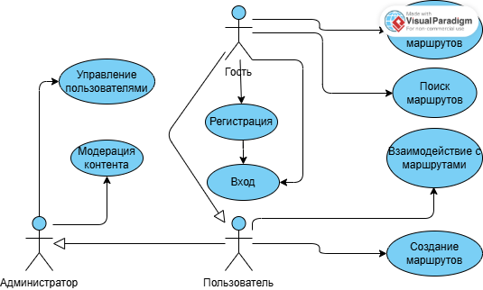

# Use Case Представление

## Диаграмма вариантов использования

## Глоссарий

| Термин | Определение |
|--------|-------------|
| **Гость** | Неаутентифицированный пользователь веб-приложения. Может просматривать публичный контент. Для создания и управления личным контентом требуется регистрация и аутентификация. |
| **Пользователь** | Аутентифицированный зарегистрированный пользователь приложения. Может создавать, просматривать, редактировать и удалять свои места и маршруты, а также просматривать публичные маршруты других пользователей. |
| **Администратор** | Привилегированный пользователь, отвечающий за управление системой, модерацию контента и техническую поддержку. Имеет доступ ко всем функциям системы. |
| **Место (Place)** | Локация, представляющая интерес для путешественника (например, достопримечательность, ресторан, отель). Содержит название, описание, адрес, координаты и тип. |
| **Маршрут (Route)** | Упорядоченный список мест, объединённый общей темой или поездкой. Имеет название, описание и статус видимости (публичный/приватный). |
| **Публичный маршрут** | Маршрут, созданный пользователем и доступный для просмотра всем посетителям приложения, включая гостей. |
| **Приватный маршрут** | Маршрут, созданный пользователем и доступный только ему. |
| **Модерация** | Процесс проверки и одобрения контента администратором перед публикацией или для соответствия правилам сообщества. |

## Содержание

1. [Актеры](#1-актеры)
2. [Варианты использования](#2-варианты-использования)
   - [2.1 Зарегистрироваться](#21-зарегистрироваться)
   - [2.2 Войти в систему](#22-войти-в-систему)
   - [2.3 Создать новое место](#23-создать-новое-место)
   - [2.4 Создать маршрут](#24-создать-маршрут)
   - [2.5 Просмотреть публичные маршруты](#25-просмотреть-публичные-маршруты)
   - [2.6 Управление пользователями](#26-управление-пользователями)
   - [2.7 Управление контентом](#27-управление-контентом)
   - [2.8 Выйти из системы](#28-выйти-из-системы)

## 1. Актеры

| Актер | Описание |
|-------|-----------|
| **Гость** | Неаутентифицированный пользователь веб-приложения. Может просматривать публичный контент. Для создания и управления личным контентом требуется регистрация и аутентификация. |
| **Пользователь** | Аутентифицированный зарегистрированный пользователь приложения. Может создавать, просматривать, редактировать и удалять свои места и маршруты, а также просматривать публичные маршруты других пользователей. |
| **Администратор** | Привилегированный пользователь, отвечающий за управление системой, модерацию контента и техническую поддержку. Имеет доступ ко всем функциям системы. |

## 2. Варианты использования

### 2.1 Зарегистрироваться

**Описание**  
Вариант использования "Зарегистрироваться" позволяет Гостю создать новую учётную запись в системе.

**Предусловия**  
Гость находится на главной странице или на странице аутентификации.

**Основной поток**
1. Гость нажимает кнопку "Зарегистрироваться"
2. Система отображает форму регистрации, запрашивая адрес электронной почты (email), имя пользователя и пароль
3. Гость вводит email, имя пользователя и пароль, подтверждает пароль и отправляет форму
4. Система проверяет валидность email (уникальность в системе), уникальность имени пользователя и соответствие пароля политике безопасности
5. Система создаёт новую учётную запись Пользователя, хэширует пароль и автоматически аутентифицирует его
6. Система перенаправляет Пользователя на его личную главную страницу
7. Вариант использования завершается

**Альтернативный поток А1: Данные невалидны**
- Если введённые данные не проходят проверку (email не уникален, имя пользователя занято, пароль слишком простой, пароли не совпадают), система отображает соответствующее сообщение об ошибке
- Возврат к пункту 3 основного потока

**Альтернативный поток А2: Отмена регистрации**
- Гость нажимает кнопку "Отмена" или возвращается на предыдущую страницу до подтверждения отправки формы
- Система возвращает Гостя на страницу, с которой был начат процесс регистрации
- Вариант использования завершается досрочно

**Постусловия**  
В системе создана новая учётная запись. Гость получает статус "Пользователь" и аутентифицирован в системе.

### 2.2 Войти в систему

**Описание**  
Вариант использования "Войти в систему" позволяет зарегистрированному Пользователю аутентифицироваться в системе.

**Предусловия**  
Пользователь не аутентифицирован (Гость) и находится на главной странице или на странице аутентификации.

**Основной поток**
1. Гость нажимает кнопку "Войти"
2. Система отображает форму входа, запрашивая email/имя пользователя и пароль
3. Пользователь вводит свои учетные данные и отправляет форму
4. Система проверяет наличие пользователя с такими данными и соответствие введённого пароля хэшу в базе данных
5. При успешной проверке система создаёт сессию и перенаправляет Пользователя на его личную главную страницу
6. Вариант использования завершается

**Альтернативный поток А1: Неверные учётные данные**
- Если email/имя пользователя или пароль неверны, система отображает общее сообщение об ошибке аутентификации ("Неверный логин или пароль")
- Возврат к пункту 3 основного потока

**Постусловия**  
Пользователь аутентифицирован в системе и имеет доступ к своему личному контенту.

### 2.3 Создать новое место

**Описание**  
Вариант использования позволяет Пользователю добавить новое место в свою личную коллекцию.

**Предусловия**  
Пользователь аутентифицирован в системе.

**Основной поток**
1. Пользователь переходит в раздел "Мои места" и нажимает кнопку "Добавить место"
2. Система отображает форму создания места
3. Пользователь заполняет форму: вводит название, описание, адрес, выбирает тип места из выпадающего списка (например, достопримечательность, ресторан, отель). Координаты могут быть заполнены автоматически на основе адреса или вручную
4. Пользователь нажимает кнопку "Сохранить"
5. Система проверяет обязательность заполнения поля "Название"
6. Система сохраняет новое место в базу данных, связывая его с текущим Пользователем
7. Система отображает сообщение об успешном сохраненении и перенаправляет Пользователя на страницу списка его мест или на страницу созданного места
8. Вариант использования завершается

**Альтернативный поток А1: Обязательные поля не заполнены**
- Если поле "Название" не заполнено, система выделяет это поле и отображает сообщение об ошибке
- Возврат к пункту 3 основного потока

**Альтернативный поток А2: Отмена создания**
- Пользователь нажимает кнопку "Отмена" до сохранения
- Система возвращает Пользователя на предыдущую страницу (например, список мест) без сохранения данных
- Вариант использования завершается досрочно

**Постусловия**  
В личной коллекции Пользователя создан новый объект "Место".

### 2.4 Создать маршрут

**Описание**  
Вариант использования позволяет Пользователю создать новый маршрут из существующих в его коллекции мест.

**Предусловия**  
Пользователь аутентифицирован в системе и имеет в коллекции как минимум одно место.

**Основной поток**
1. Пользователь переходит в раздел "Мои маршруты" и нажимает кнопку "Создать маршрут"
2. Система отображает форму создания маршрута
3. Пользователь вводит название и описание маршрута
4. Пользователь выбирает статус видимости маршрута (Публичный/Приватный) с помощью переключателя
5. Из списка "Мои места" Пользователь перетаскивает или выбирает места и добавляет их в маршрут, устанавливая нужный порядок
6. Пользователь нажимает кнопку "Сохранить маршрут"
7. Система проверяет, что указано название и в маршрут добавлено хотя бы одно место
8. Система сохраняет новый маршрут в базу данных
9. Система отображает сообщение об успехе и перенаправляет Пользователя на страницу созданного маршрута
10. Вариант использования завершается

**Альтернативный поток А1: Данные невалидны**
- Если название не указано или в маршруте нет мест, система отображает соответствующее сообщение об ошибке
- Возврат к пункту 3 основного потока

**Альтернативный поток А2: У Пользователя нет мест**
- Если коллекция мест Пользователя пуста, при открытии формы создания маршрута система отображает информационное сообщение с предложением сначала создать место
- Вариант использования завершается или переходит к сценарию "Создать новое место"

**Постусловия**  
В системе создан новый маршрут, связанный с Пользователем. Если маршрут публичный, он становится виден другим пользователям и гостям.

### 2.5 Просмотреть публичные маршруты

**Описание**  
Вариант использования позволяет любому посетителю приложения (Гостю или Пользователю) просматривать маршруты, которые были опубликованы как публичные.

**Предусловия**  
Актер находится в приложении.

**Основной поток**
1. Актер переходит в раздел "Исследовать" или "Публичные маршруты"
2. Система отображает ленту или список публичных маршрутов, созданных всеми пользователями. Для каждого маршрута отображается название, автор, краткое описание и обложка (если есть)
3. Актер может использовать поиск по названию или фильтры (например, по типу мест в маршруте) для сужения результатов
4. Актер выбирает (кликает) на понравившийся маршрут для просмотра деталей
5. Система открывает страницу маршрута, где отображается полное описание, карта с отмеченными местами и их упорядоченный список
6. Вариант использования завершается

**Альтернативный поток А1: Публичные маршруты отсутствуют**
- Если в системе нет ни одного публичного маршрута, система отображает сообщение "Публичные маршруты пока не добавлены"

**Постусловия**  
Актер ознакомился с содержимым публичного маршрута.

### 2.6 Управление пользователями

**Описание**  
Вариант использования позволяет Администратору управлять учетными записями пользователей системы.

**Предусловия**  
Администратор аутентифицирован в системе.

**Основной поток**
1. Администратор переходит в панель управления в раздел "Пользователи"
2. Система отображает список всех зарегистрированных пользователей с информацией о дате регистрации, статусе и количестве созданного контента
3. Администратор может выполнять поиск пользователей по имени или email
4. Администратор выбирает конкретного пользователя из списка
5. Система отображает детальную информацию о пользователе и доступные действия
6. Администратор может выполнить одно из действий: заблокировать/разблокировать аккаунт, сбросить пароль, назначить/лишить прав администратора
7. Система запрашивает подтверждение для критических действий (блокировка, смена прав)
8. После подтверждения система применяет изменения и обновляет статус пользователя
9. Система отображает сообщение об успешном выполнении операции
10. Вариант использования завершается

**Альтернативный поток А1: Пользователь не найден**
- Если поиск не дал результатов, система отображает сообщение "Пользователи не найдены"

**Альтернативный поток А2: Отмена операции**
- Администратор отменяет операцию до подтверждения
- Система возвращает Администратора к списку пользователей без изменений
- Вариант использования завершается досрочно

**Постусловия**  
Статус или права выбранного пользователя изменены в системе.

### 2.7 Управление контентом

**Описание**  
Вариант использования позволяет Администратору модерировать пользовательский контент (места и маршруты).

**Предусловия**  
Администратор аутентифицирован в системе.

**Основной поток**
1. Администратор переходит в панель управления в раздел "Модерация контента"
2. Система отображает списки мест и маршрутов, ожидающих модерации, а также все существующие публикации
3. Администратор выбирает конкретный объект (место или маршрут) для модерации
4. Система отображает полную информацию о выбранном объекте
5. Администратор проверяет контент на соответствие правилам сообщества
6. Администратор принимает решение: одобрить, отклонить с комментарием или отредактировать контент
7. Система применяет решение: публикует контент, отправляет уведомление автору с комментарием или сохраняет исправленную версию
8. Система обновляет статус контента в системе
9. Вариант использования завершается

**Альтернативный поток А1: Контент соответствует правилам**
- Если контент не требует изменений, Администратор просто одобряет его для публикации

**Альтернативный поток А2: Контент нарушает правила**
- Если контент содержит недопустимую информацию, Администратор отклоняет его с обязательным комментарием о причине

**Постусловия**  
Статус пользовательского контента изменен, автор уведомлен о решении модерации (если применимо).

### 2.8 Выйти из системы

**Описание**  
Вариант использования позволяет аутентифицированному Пользователю завершить сеанс работы в системе.

**Предусловия**  
Пользователь аутентифицирован в системе.

**Основной поток**
1. Пользователь нажимает на свой аватар или имя в интерфейсе приложения и выбирает опцию "Выйти" из выпадающего меню
2. Система инвалидирует сессию пользователя
3. Система перенаправляет пользователя на главную страницу для гостей
4. Вариант использования завершается

**Постусловия**  
Пользователь более не аутентифицирован в системе и имеет статус "Гость".
